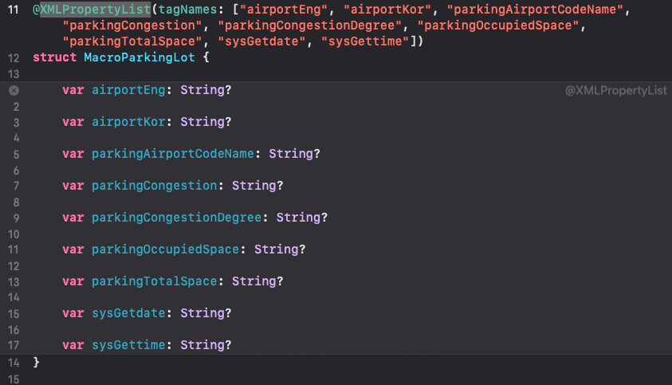
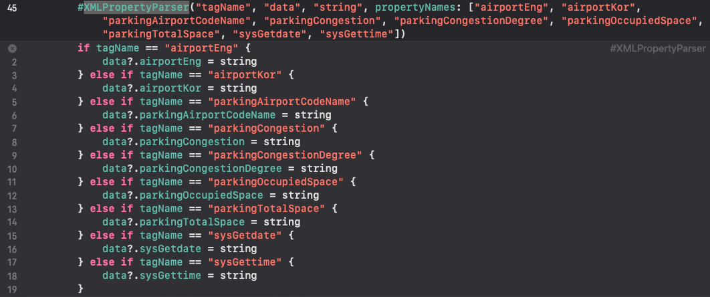

# XMLParser-SwiftMacro

## Overview
XMLParser와 SwiftMacro를 사용하여 XML Data Parsing 시에 생기는 번거로움 해소

## 사용될 XML Data
``` xml
<?xml version="1.0" encoding="UTF-8" standalone="yes"?>
<response>
    <header>
        <resultCode>00</resultCode>
        <resultMsg>NORMAL SERVICE.</resultMsg>
    </header>
    <body>
        <items>
            <item>
                <airportEng>GIMPO INTERNATIONAL AIRPORT</airportEng>
                <airportKor>김포국제공항</airportKor>
                <parkingAirportCodeName>국내선 제1주차장</parkingAirportCodeName>
                <parkingCongestion>원활</parkingCongestion>
                <parkingCongestionDegree>83.06%</parkingCongestionDegree>
                <parkingOccupiedSpace>1893</parkingOccupiedSpace>
                <parkingTotalSpace>2279</parkingTotalSpace>
                <sysGetdate>2024-08-03</sysGetdate>
                <sysGettime>21:38:02</sysGettime>
            </item>
            <item>
                <airportEng>GIMPO INTERNATIONAL AIRPORT</airportEng>
                <airportKor>김포국제공항</airportKor>
                <parkingAirportCodeName>국내선 제2주차장</parkingAirportCodeName>
                <parkingCongestion>원활</parkingCongestion>
                <parkingCongestionDegree>74.84%</parkingCongestionDegree>
                <parkingOccupiedSpace>1297</parkingOccupiedSpace>
                <parkingTotalSpace>1733</parkingTotalSpace>
                <sysGetdate>2024-08-03</sysGetdate>
                <sysGettime>21:38:02</sysGettime>
            </item>
            <item>
                <airportEng>GIMPO INTERNATIONAL AIRPORT</airportEng>
                <airportKor>김포국제공항</airportKor>
                <parkingAirportCodeName>국제선 주차빌딩</parkingAirportCodeName>
                <parkingCongestion>혼잡</parkingCongestion>
                <parkingCongestionDegree>91.01%</parkingCongestionDegree>
                <parkingOccupiedSpace>516</parkingOccupiedSpace>
                <parkingTotalSpace>567</parkingTotalSpace>
                <sysGetdate>2024-08-03</sysGetdate>
                <sysGettime>21:38:02</sysGettime>
            </item>
            <item>
                <airportEng>GIMPO INTERNATIONAL AIRPORT</airportEng>
                <airportKor>김포국제공항</airportKor>
                <parkingAirportCodeName>국제선 지하</parkingAirportCodeName>
                <parkingCongestion>만차</parkingCongestion>
                <parkingCongestionDegree>96.5%</parkingCongestionDegree>
                <parkingOccupiedSpace>1158</parkingOccupiedSpace>
                <parkingTotalSpace>1200</parkingTotalSpace>
                <sysGetdate>2024-08-03</sysGetdate>
                <sysGettime>21:38:02</sysGettime>
            </item>
            <item>
                <airportEng>GIMPO INTERNATIONAL AIRPORT</airportEng>
                <airportKor>김포국제공항</airportKor>
                <parkingAirportCodeName>화물청사</parkingAirportCodeName>
                <parkingCongestion>원활</parkingCongestion>
                <parkingCongestionDegree>63.23%</parkingCongestionDegree>
                <parkingOccupiedSpace>466</parkingOccupiedSpace>
                <parkingTotalSpace>737</parkingTotalSpace>
                <sysGetdate>2024-08-03</sysGetdate>
                <sysGettime>21:38:02</sysGettime>
            </item>
        </items>
        <numOfRows>20</numOfRows>
        <pageNo>1</pageNo>
        <totalCount>5</totalCount>
    </body>
</response>
```

## 기존 코드
- XML Data Model
``` Swift 
struct ParkingLot {
    var airportEng: String? // = "GIMPO INTERNATIONAL AIRPORT"
    var airportKor: String? // = "김포국제공항"
    var parkingAirportCodeName: String? // = "국내선 제1주차장"
    var parkingCongestion: String? // = "원활"
    var parkingCongestionDegree: String? // = "83.06%"
    var parkingOccupiedSpace: String? // = "1893"
    var parkingTotalSpace: String? // = "2279"
    var sysGetdate: String? // = "2024-08-03"
    var sysGettime: String? // = "21:38:02"
}
```

- XML Data Parser
``` Swift
final class ParkingLotXMLParser: NSObject, XMLParserDelegate {
    private var tagName: String?
    private var itemList: [ParkingLot] = []
    private var data: ParkingLot?
    
    ...
    
    func parser(_ parser: XMLParser, foundCharacters string: String) {
        if string.trimmingCharacters(in: .whitespacesAndNewlines).isEmpty { return }
        if tagName == "airportEng" {
            data?.airportEng = string
        } else if tagName == "airportKor" {
            data?.airportKor = string
        } else if tagName == "parkingAirportCodeName" {
            data?.parkingAirportCodeName = string
        } else if tagName == "parkingCongestion" {
            data?.parkingCongestion = string
        } else if tagName == "parkingCongestionDegree" {
            data?.parkingCongestionDegree = string
        } else if tagName == "parkingOccupiedSpace" {
            data?.parkingOccupiedSpace = string
        } else if tagName == "parkingTotalSpace" {
            data?.parkingTotalSpace = string
        } else if tagName == "sysGetdate" {
            data?.sysGetdate = string
        } else if tagName == "sysGettime" {
            data?.sysGettime = string
        }
    }

    ...
```
> 이처럼 변수명과 태그이름을 직접 매칭해야하는 문제 발생

## 시도할 방법
- 태그 배열로 데이터 모델 자동 생성
  ``` Swift
  @XMLPropertyList(tagNames: ["airportEng", "airportKor", "parkingAirportCodeName", "parkingCongestion", "parkingCongestionDegree", "parkingOccupiedSpace", "parkingTotalSpace", "sysGetdate", "sysGettime"])
  struct MacroParkingLot {
    
  }
  ```
- 선언된 데이터를 `Mirror`를 통해 Parser에 변수명 전달
  ``` Swift
  let propertyList = Mirror(reflecting: MacroParkingLot()).children.compactMap { $0.label }
  #XMLPropertyParser("tagName", "data", "string", propertyNames: propertyList)
  ```
> 즉, 최소에 1회 태그 배열만 직접 작성하면 Parser에서 다시 작성할 필요가 없음.

## 결과
### Data Model

> 데이터 모델이 잘 생성됨

### XMLParser

> Parser 생성 실패

## 실패 원인
- Macro는 작성된 Syntax Tree에만 Access 가능하다.
  - 즉, 런타임에서 확인될 수 있는 변수값에는 Access가 불가능하다.

## 해결 방안
- Data Model 작성 시에 사용한 태그 배열을 붙여넣기 하면 정상적으로 작동


## Conclusion
- 매크로 작동 시점과 원리에 대한 이해 필요
What’s new in Swift(Macro Section) - https://developer.apple.com/videos/play/wwdc2023/10164/
Write Swift macros - https://developer.apple.com/videos/play/wwdc2023/10166/
Expand on Swift macros - https://developer.apple.com/videos/play/wwdc2023/10167